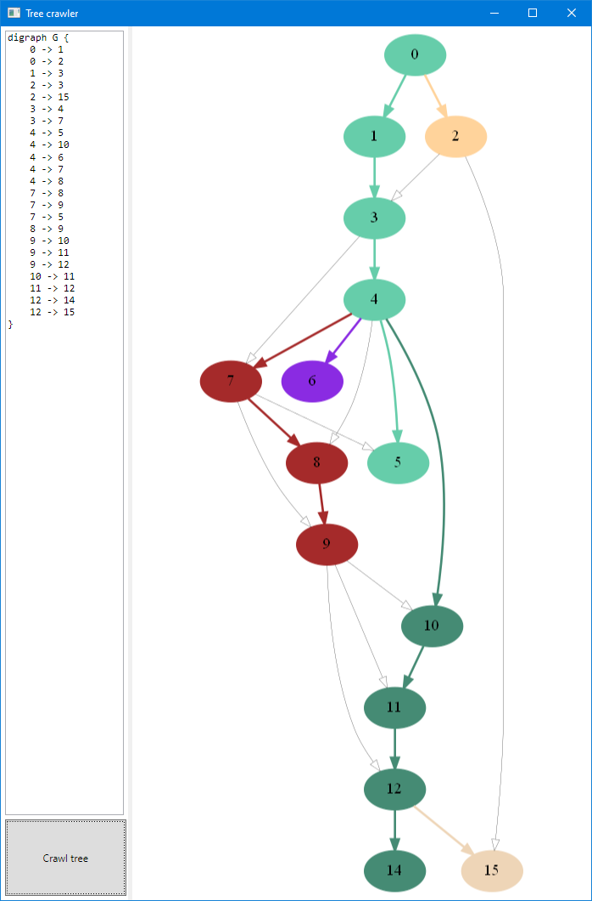

# Tree Crawler

Small application that implements DFS (Depth First Search) algorithm and graphically shows the result in a WPF application

## Documentation

* [GraphVizNet](https://github.com/valentiniliescu/GraphVizNet)
* [GraphViz](https://graphviz.org/)
* [GraphViz Online editor](https://dreampuf.github.io/GraphvizOnline)